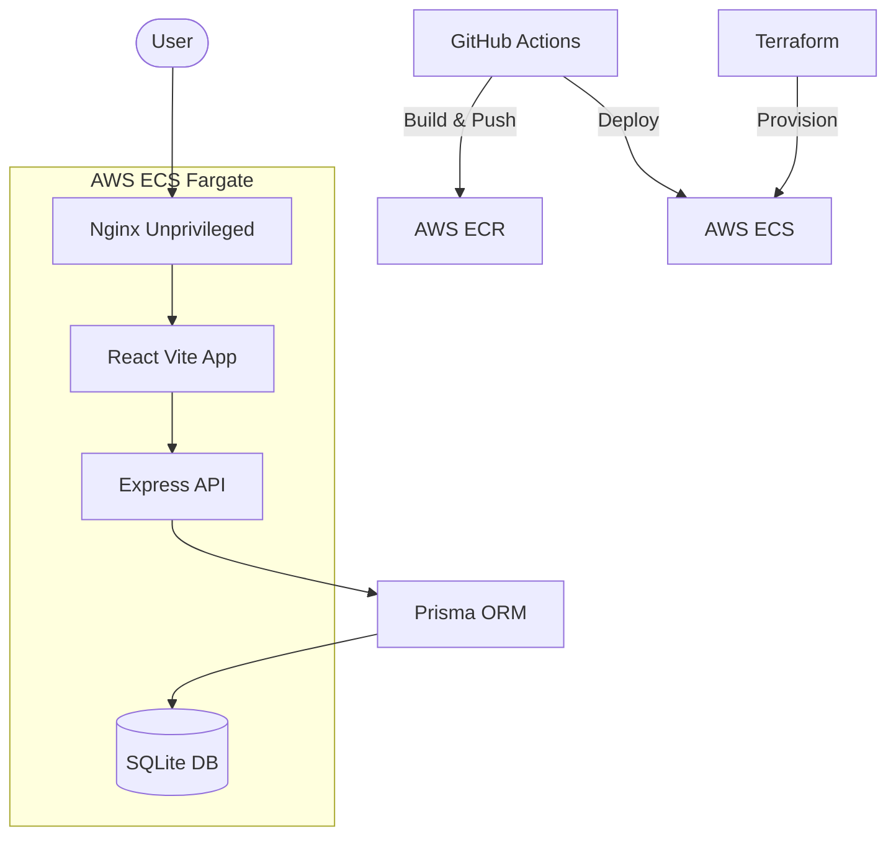

# 🛒 ShopSmart

ShopSmart is a high-performance, full-stack e-commerce platform designed to showcase modern web development and professional DevOps engineering. It features a React-based frontend, a Node.js backend, and a fully automated infrastructure deployed on AWS.

## 🚀 Key Features

- **User Authentication**: Secure login and registration.
- **Product Catalog**: Dynamic product listings with category filtering.
- **Shopping Cart**: Real-time cart management.
- **Responsive Design**: Optimized for all devices using modern CSS.
- **DevOps Excellence**: Automated CI/CD, Infrastructure as Code, and Containerization.

## 🛠 Tech Stack

### Frontend
- **Framework**: React 18 (Vite)
- **Styling**: Vanilla CSS with modern design tokens
- **State Management**: React Context API & Hooks
- **Testing**: Vitest / Playwright (E2E)

### Backend
- **Runtime**: Node.js 20
- **Framework**: Express.js
- **ORM**: Prisma
- **Database**: SQLite (Production-ready volume-backed storage)

### Infrastructure & DevOps
- **Containerization**: Docker (Multi-stage builds, Non-root security)
- **Orchestration**: AWS ECS Fargate
- **Registry**: AWS ECR
- **IaC**: Terraform
- **CI/CD**: GitHub Actions

## 🏗 Architecture



## 🛠 Local Development

### Prerequisites
- Node.js (v18+)
- Docker (optional, for containerized dev)

### Setup Instructions

1.  **Clone the repository**:
    ```bash
    git clone <repo-url>
    cd shopsmart
    ```

2.  **Install Dependencies**:
    ```bash
    npm run setup
    ```
    *(This script installs root, client, and server dependencies)*

3.  **Run Migrations**:
    ```bash
    cd server && npx prisma migrate dev
    ```

4.  **Start Development Servers**:
    ```bash
    # Root directory
    npm run dev
    ```

## 🧪 Testing

We maintain high code quality through a comprehensive testing suite:

- **Unit/Integration Tests**: `npm run test`
- **End-to-End Tests**: `npm run test:e2e` (Powered by Playwright)
- **Linting**: `npm run lint`

## 🚢 Deployment

The project is deployed using a fully automated pipeline:

1.  **Terraform**: Provisions the required AWS resources (ECS Cluster, ECR, Task Definitions).
2.  **GitHub Actions**:
    - Runs linting and tests on every PR.
    - Builds multi-stage Docker images.
    - Pushes images to AWS ECR.
    - Triggers a rolling update on the ECS Fargate service.

---

*This project was developed with a focus on Rubric Compliance and Production-Grade standards.*
